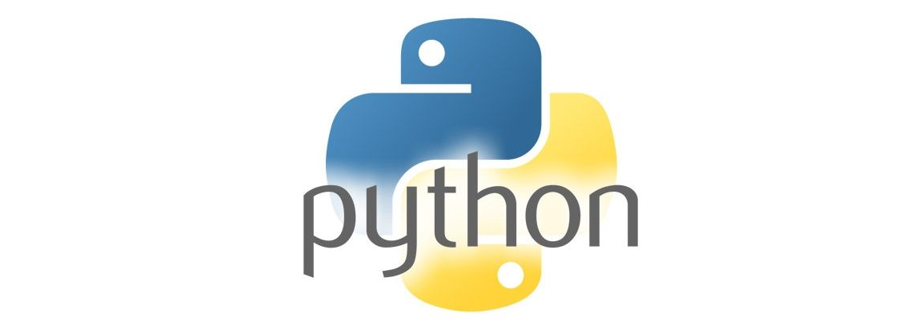
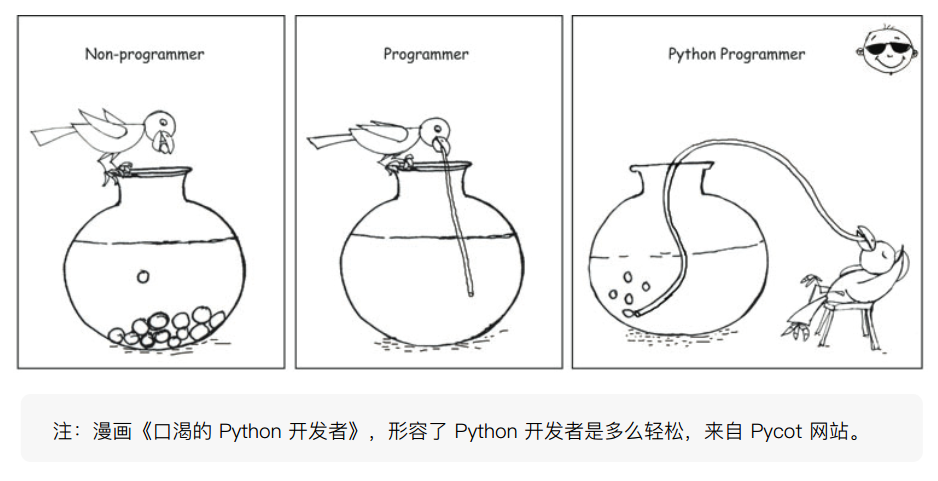
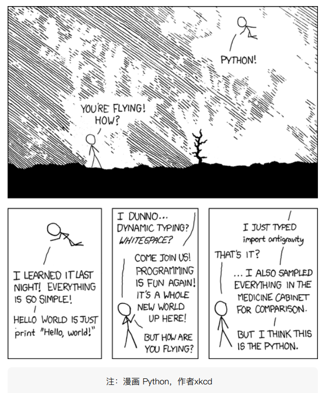
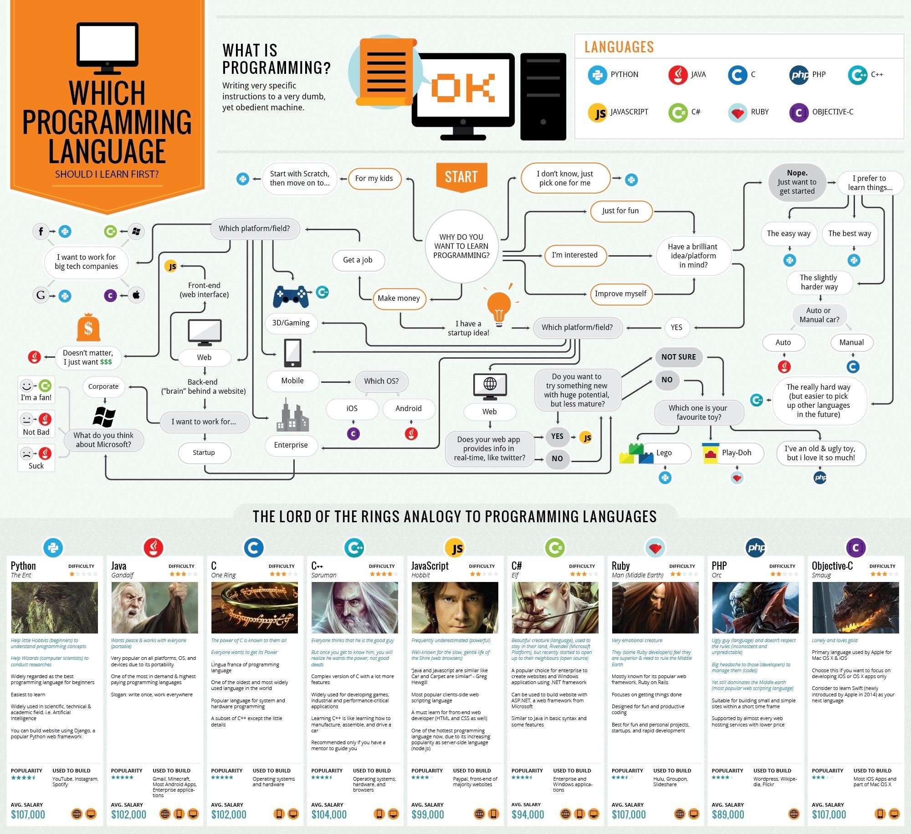
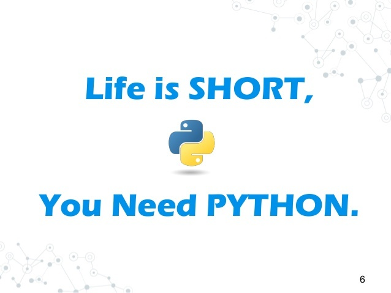

# Python学习笔记



Python 是一个高层次的结合了解释性、编译性、互动性和面向对象的脚本语言。

Python 的设计具有很强的可读性，相比其他语言经常使用英文关键字，其他语言的一些标点符号，它具有比其他语言更有特色语法结构。

* Python 是一种解释型语言： 这意味着开发过程中没有了编译这个环节。类似于PHP和Perl语言。
* Python 是交互式语言： 这意味着，您可以在一个Python提示符，直接互动执行写你的程序。
* Python 是面向对象语言: 这意味着Python支持面向对象的风格或代码封装在对象的编程技术。

Python 是初学者的语言：Python 对初级程序员而言，是一种伟大的语言，它支持广泛的应用程序开发，从简单的文字处理到 WWW 浏览器再到游戏。

## 本仓库说明

1. Python学习笔记

```
Something I hope you know before go into the coding~
* First, please watch or star this repo, I'll be more happy if you follow me.
* Bug report, questions and discussion are welcome, you can post an issue or pull a request.
```

## 目录

* [Python学习笔记](README.md)
* [Python简介](docs/Python简介.md)
* [Python环境搭建](docs/Python环境搭建/Python环境搭建.md)
* [Python基本数据类型](docs/Python基本数据类型/Python基本数据类型.md)
    * [字符串类型](docs/Python基本数据类型/字符串类型.md)
    * [整型](docs/Python基本数据类型/整型.md)
    * [浮点类型](docs/Python基本数据类型/浮点类型.md)
* [Python运算符](docs/Python运算符/Python运算符.md)
    * [Python比较运算符](docs/Python运算符/Python比较运算符.md)
    * [Python成员运算符](docs/Python运算符/Python成员运算符.md)
    * [Python身份运算符](docs/Python运算符/Python身份运算符.md)
    * [Python布尔运算符](docs/Python运算符/Python布尔运算符.md)
* [Python循环控制](docs/Python循环控制/Python循环控制.md)
    * [for循环](docs/Python循环控制/for循环.md)
    * [while循环](docs/Python循环控制/while循环.md)
* [Python条件判断](docs/Python条件判断/Python条件判断.md)
    * [Python逻辑判断True&False](docs/Python条件判断/Python逻辑判断True&False.md)
    * [Python条件控制](docs/Python条件判断/Python条件控制.md)
* [Python数据结构](docs/Python数据结构/Python数据结构.md)
    * [列表](docs/Python数据结构/列表.md)
    * [字典](docs/Python数据结构/字典.md)
    * [元组](docs/Python数据结构/元组.md)
    * [集合](docs/Python数据结构/集合.md)
    * [推导式](docs/Python数据结构/推导式.md)
* [Python函数](docs/Python函数/Python函数.md)
    * [Python内建函数](docs/Python函数/Python内建函数.md)
    * [Python自定义函数](docs/Python函数/Python自定义函数.md)
* [Python类](docs/Python类/Python类.md)
    * [Python类的定义](docs/Python类/Python类的定义.md)
    * [Python类的实例化](docs/Python类/Python类的实例化.md)
    * [Python类的继承](docs/Python类/Python类的继承.md)
* [Python库](docs/Python库/Python库.md)
    * [pip工具](docs/Python库/pip工具.md)
    * [Python虚拟化环境](docs/Python库/Python虚拟化环境.md)
* [老男孩系列Python教程](docs/老男孩系列Python教程.md)
    * [课程表](docs/老男孩系列Python教程/课程表.md)
    * [框架](docs/老男孩系列Python教程/框架.md)

## Python资源

* Python 3.5.2文档<https://yiyibooks.cn/xx/python_352/index.html>
* Pypi<https://pypi.org/>

## Python优点

* 优雅-使你能够专注于解决问题而不是去搞明白语言本身
* 功能强大-牛逼的兼容性-丰富的库
* 胶水语言-支持混合编译的方式使用其他语言的库
* 简单










---
