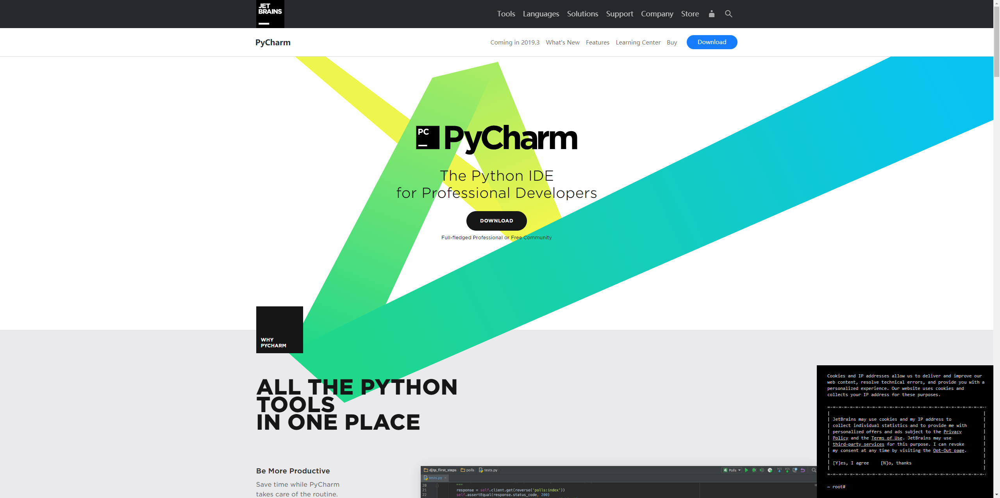

# PyCharm开发环境

官网链接: <https://www.jetbrains.com/pycharm/>

* PyCharm是一种Python IDE，其带有一整套可以帮助用户在使用Python语言开发时提高其效率的工具，比如， 调试、**语法高亮**、Project管理、代码跳转、**智能提示**、自动完成、单元测试、版本控制等等。 此外，该IDE提供了一些高级功能，以用于支持Django框架下的专业Web开发。
* 一次获得所有Python工具，方便开发使用
