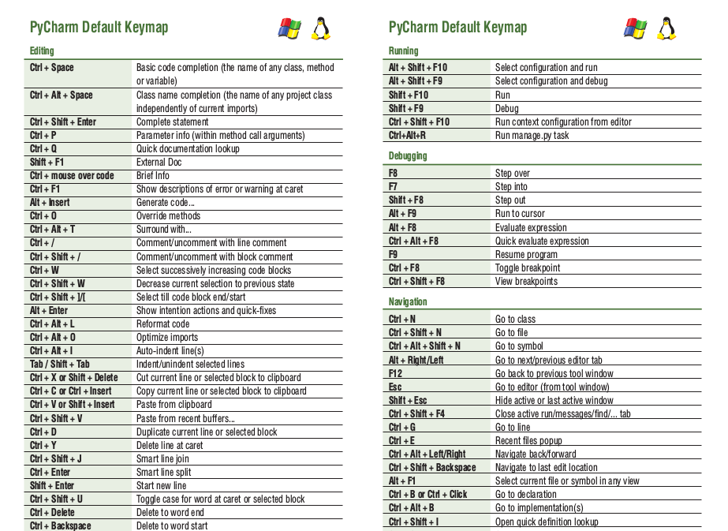
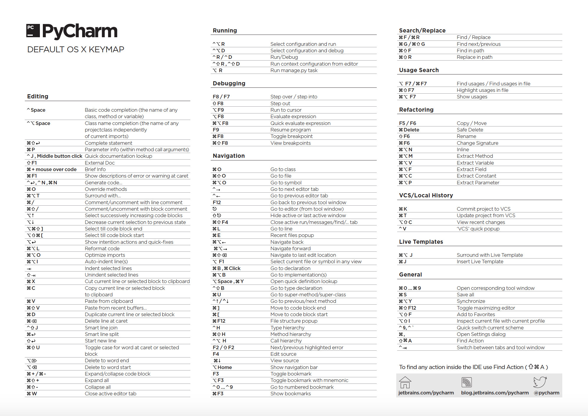

# PyCharm快捷键

* 用到的才列出来，没用的列出来也没用

| 快捷键         | 功能                       |
| -------------- | -------------------------- |
| Ctrl+Alt+s     | 快速打开设置               |
| Ctrl+Shift+F10 | 运行当前打开的py文件       |
| Ctrl+d         | 复制当前行到下一行         |
| Shift+Enter    | 向下插入行，光标跳转到改行 |
| Ctrl+/         | 注释行                     |
| Ctrl+y         | 删除当前行                 |
| Ctrl+Alt+l     | 格式化代码                 |
|                |                            |

---

 
