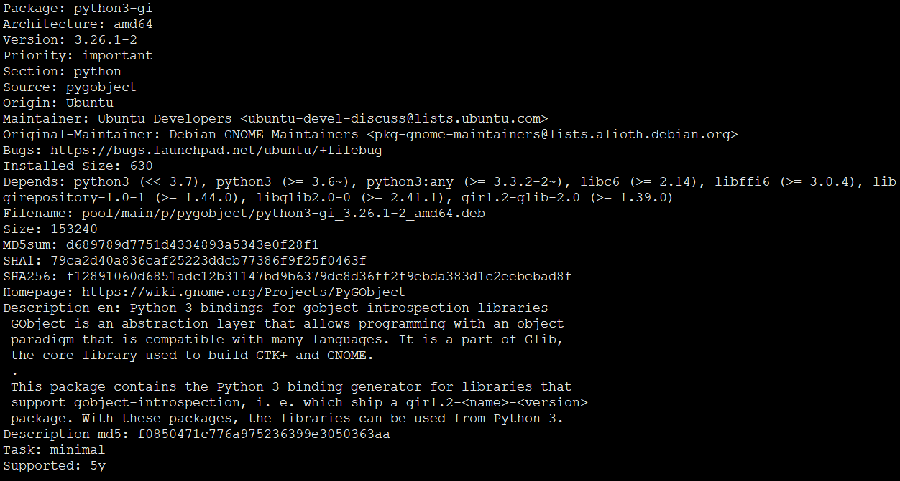

# PyCharm添加模块

## pip源配置


1. <http://mirrors.cloud.tencent.com/pypi/simple>
2. <http://mirrors.aliyun.com/simple>
3. <http://pypi.douban.com/simple>


## 注意

1. 部分库只在部分平台有。例如gi库



```
[root@ubuntu18 /]$ dpkg-query -L python3-gi

/usr/lib/python3/dist-packages/gi/__init__.py
/usr/lib/python3/dist-packages/gi/_constants.py
/usr/lib/python3/dist-packages/gi/_error.py
/usr/lib/python3/dist-packages/gi/_gi.cpython-36m-x86_64-linux-gnu.so
/usr/lib/python3/dist-packages/gi/_option.py
/usr/lib/python3/dist-packages/gi/_propertyhelper.py
/usr/lib/python3/dist-packages/gi/_signalhelper.py
/usr/lib/python3/dist-packages/gi/docstring.py
/usr/lib/python3/dist-packages/gi/importer.py
/usr/lib/python3/dist-packages/gi/module.py
/usr/lib/python3/dist-packages/gi/overrides
/usr/lib/python3/dist-packages/gi/overrides/GIMarshallingTests.py
/usr/lib/python3/dist-packages/gi/overrides/GLib.py
/usr/lib/python3/dist-packages/gi/overrides/GObject.py
/usr/lib/python3/dist-packages/gi/overrides/Gdk.py
/usr/lib/python3/dist-packages/gi/overrides/Gio.py
/usr/lib/python3/dist-packages/gi/overrides/Gtk.py
/usr/lib/python3/dist-packages/gi/overrides/Pango.py
/usr/lib/python3/dist-packages/gi/overrides/__init__.py
/usr/lib/python3/dist-packages/gi/overrides/keysyms.py
/usr/lib/python3/dist-packages/gi/pygtkcompat.py
/usr/lib/python3/dist-packages/gi/repository
/usr/lib/python3/dist-packages/gi/repository/__init__.py
/usr/lib/python3/dist-packages/gi/types.py
/usr/lib/python3/dist-packages/pygobject-3.26.1.egg-info
/usr/lib/python3/dist-packages/pygtkcompat
/usr/lib/python3/dist-packages/pygtkcompat/__init__.py
/usr/lib/python3/dist-packages/pygtkcompat/generictreemodel.py
/usr/lib/python3/dist-packages/pygtkcompat/pygtkcompat.py

/usr/share/doc/python3-gi/changelog.Debian.gz
/usr/share/doc/python3-gi/copyright
```

gi库旨在python GTK 图形界面编程。GTK用于GNOME环境下，win环境没有

PyGtk官方介绍：
```
PyGTK is a set of wrappers written in Python and C for GTK + GUI library. It is part of the GNOME project. It offers comprehensive tools for building desktop applications in Python. This tutorial discusses the basic functionalities of the different widgets found in the toolkit.
```
补充说明：
```
gi.repository module is called PyGObject and is for Gtk+3 and is not yet available for Windows (there has been experiments, but is not ready AFAIK). https://live.gnome.org/PyGObject

gtk module is called PyGtk and is for Gtk+2 and is very mature on Windows platforms (in particular 2.24). http://www.pygtk.org/
```
