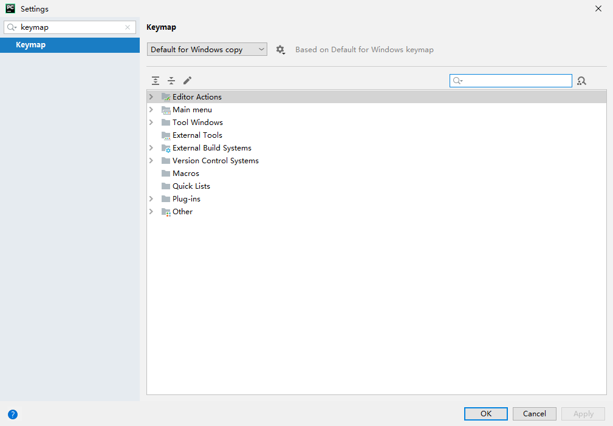
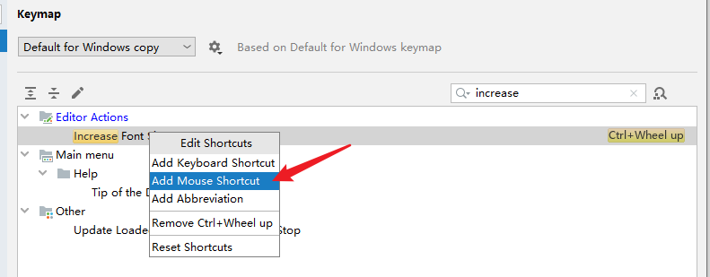
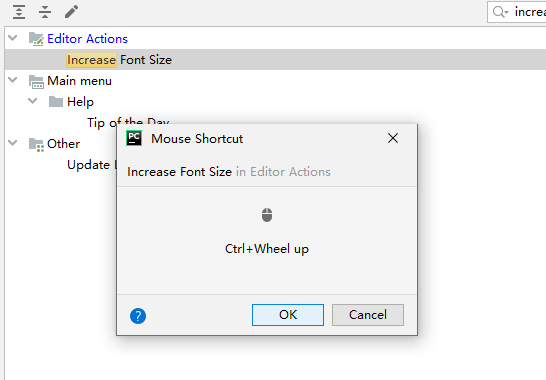
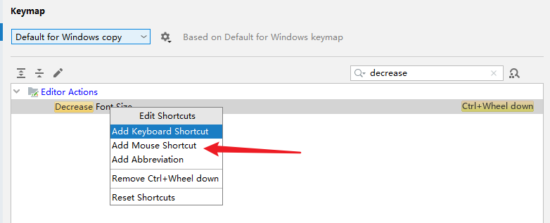
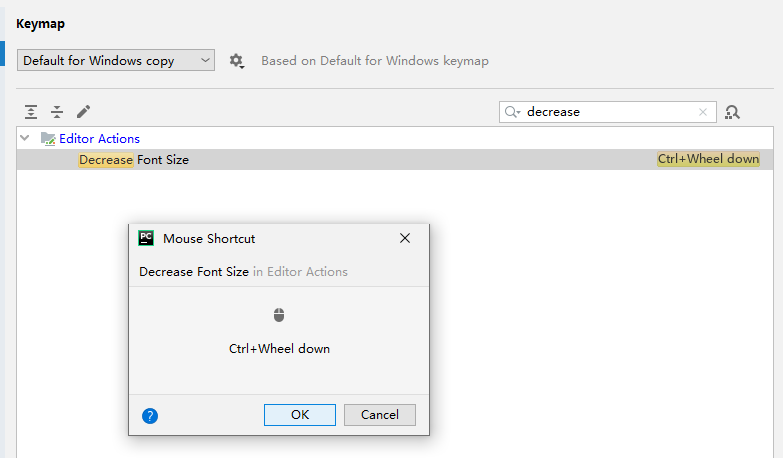

# Pycharm用Ctrl+鼠标滚轮控制字体大小

1. 快捷键 **ctrl+alt+s** 进入设置。
2. 快速搜索里面找Keymap

3. 在Keymap的搜索栏里输入**increase**

4. 选择**Add Mouse Shortcut**，此时按住 **ctrl，鼠标滚轮向上** ，设置放大字体快捷键完毕

5. 同理缩小字体，在Keymap的搜索栏里输入**decrease**,选择**Add Mouse Shortcut**，
此时按住 **ctrl，鼠标滚轮向下** ，设置缩小字体快捷键完毕

