# 获取PyCharm

* 官网<https://www.jetbrains.com/pycharm/>下载社区版本即可

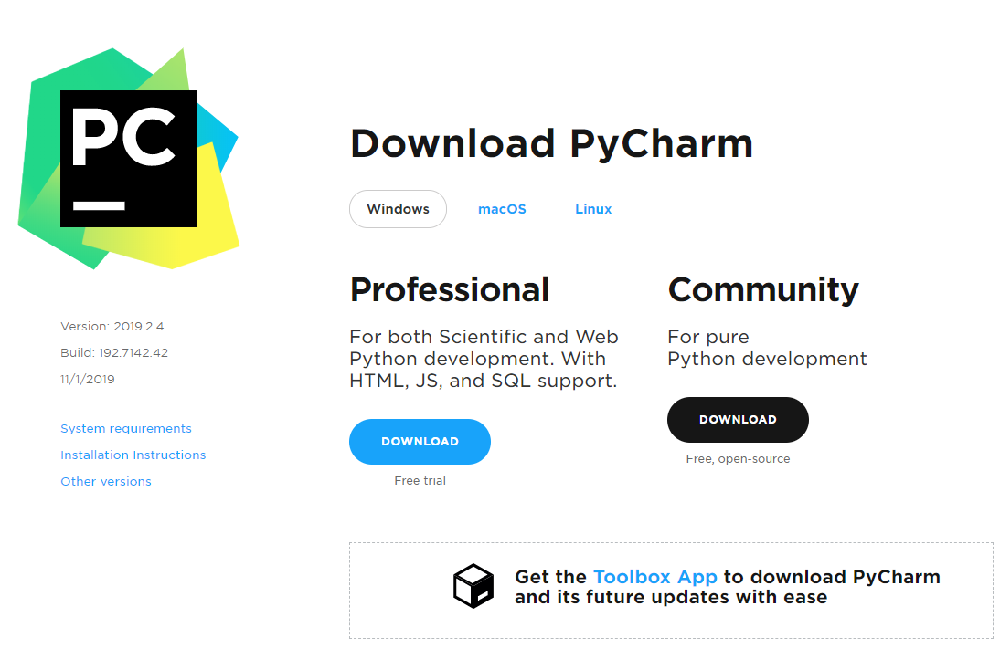

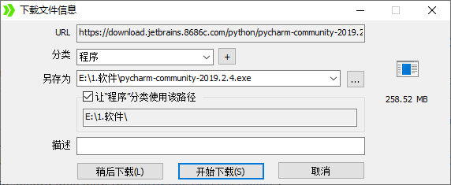

* 大小大概在258MB左右，视具体版本

## 安装过程

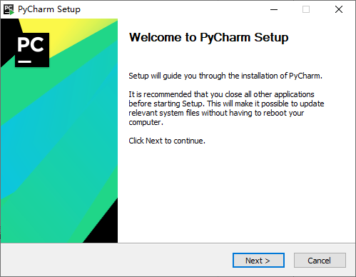

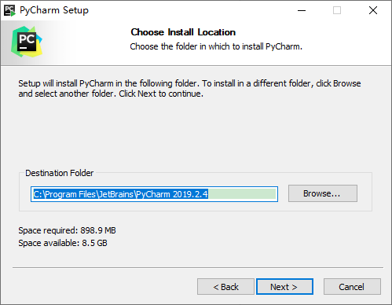

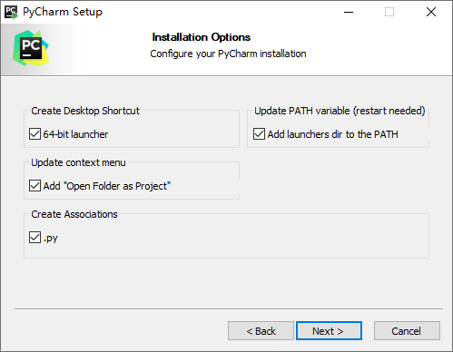

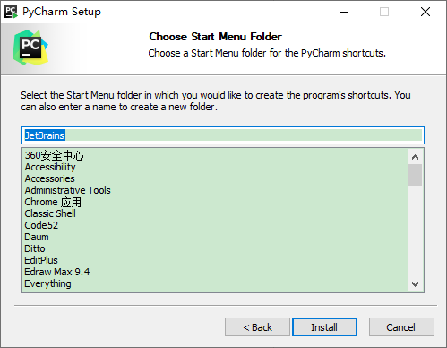

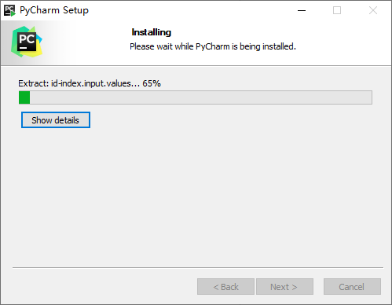

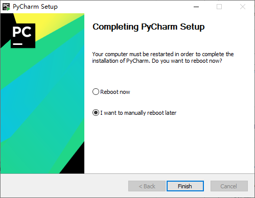

* 安装完成需要重启使能环境变量


## 初次打开


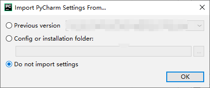

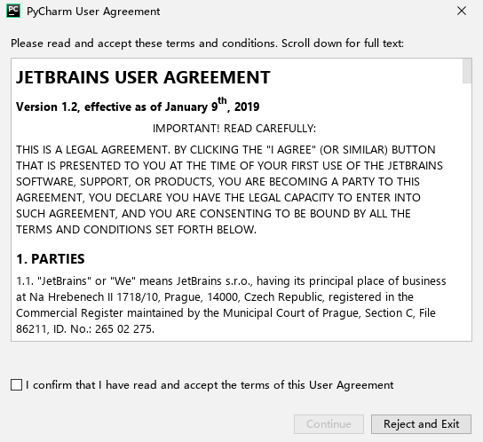

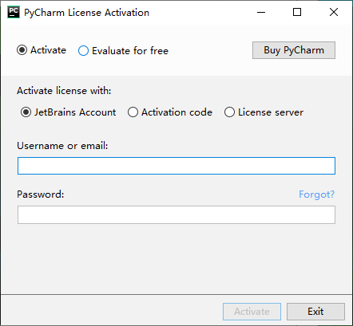

选择```Activation code```，吾爱破解上找一波激活码，网上总是有的，天朝人从来不花钱买软件

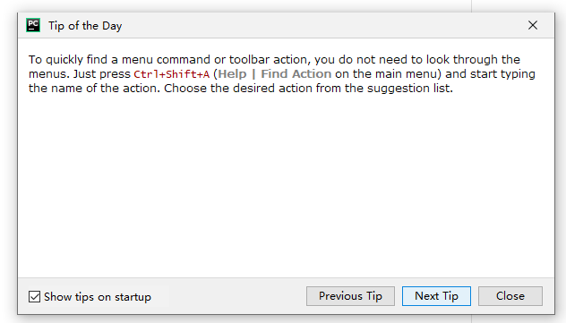


---
