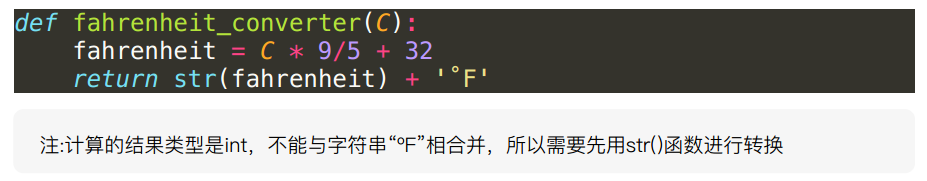
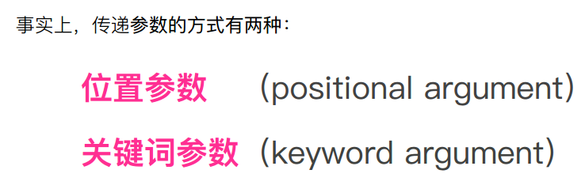
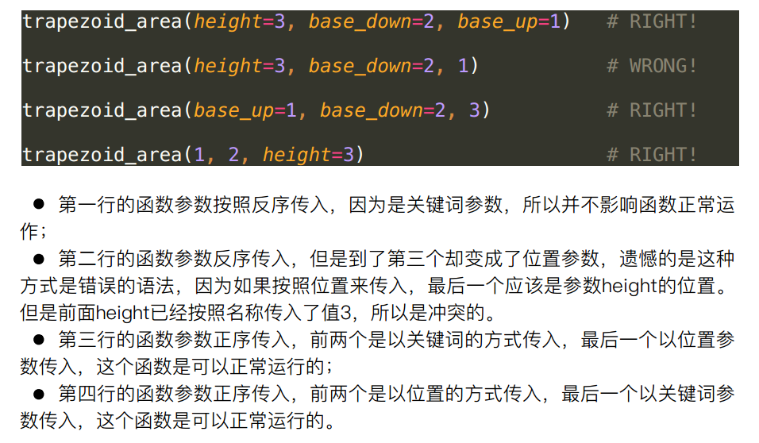

# Python自定义函数

## def定义函数

* def和return都是关键字，Python靠识别特定的关键字来明白用户的意图
* 闭合括号后面的冒号不可少，并且注意中英文冒号不同会导致错误

* def冒号回车过后会自动的进行一次缩进。函数缩进后的语句被称为语句块。
* 缩进是为了表明语句和逻辑的从属关系，是Python区别于其他语言的特征。

## 传递参数与参数类型

* 关键词参数的坑
* 默认参数就是定义函数的时候在参数列表直接赋值就是

* 很形象的例子，形参只是占位符，实参才是进行具体操作的

---
