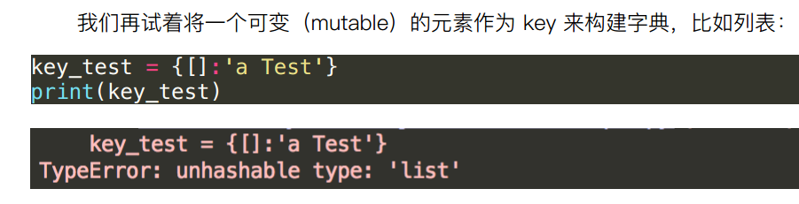

# 字典

特点 : 内容绑定 key:value

* 键不能重复，值可以重复
* 键不能修改，值可以修改
* 字典不能够切片

* 可变元素不能作为键

## 内置函数

常用方法必须包括增删改查

其他方法：

### keys()
### values()
### items()

### dict.update()增加元素

### dict删除元素del

### pop

### popitem

### del dict1

## 转换

列表 -> 字典
字典 -> 列表

---
