<!-- MDTOC maxdepth:6 firsth1:1 numbering:0 flatten:0 bullets:1 updateOnSave:1 -->

- [Python环境搭建](#python环境搭建)   
   - [Python3安装过程](#python3安装过程)   
   - [Python3卸载过程](#python3卸载过程)   
   - [坚持使用Python3，Python2将在2020年寿终正寝](#坚持使用python3，python2将在2020年寿终正寝)   
   - [Python3编码问题](#python3编码问题)   

<!-- /MDTOC -->
# Python环境搭建

## Python3安装过程

* Python官网下载：<https://www.python.org/downloads/>

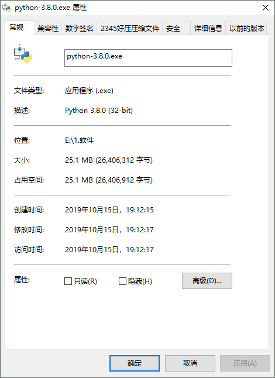

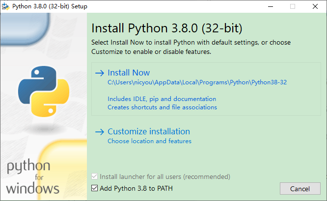

**安装路径不得出现中文字符及特殊字符！**

**安装路径不得出现中文字符及特殊字符！**

**安装路径不得出现中文字符及特殊字符！**

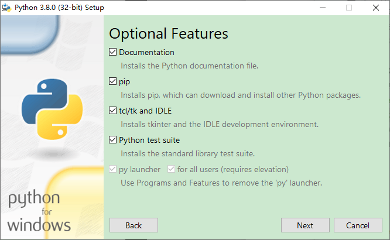

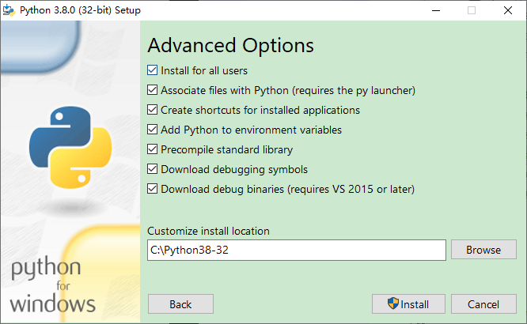

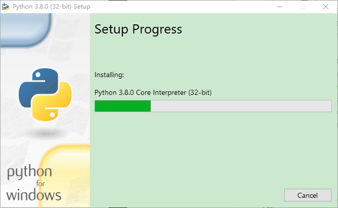

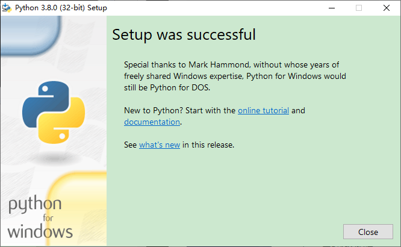

可以查看环境变量配置，已经自动添加了Python3相关内容

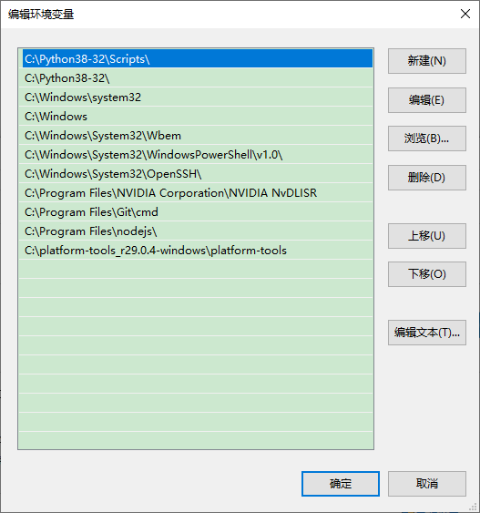

* 修改环境变量一定要重启相关程序才能生效，重载环境变量
* 默认优先通过系统环境变量查找，然后是用户环境变量。因此系统环境变量优先。

## Python3卸载过程

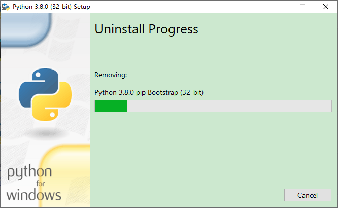

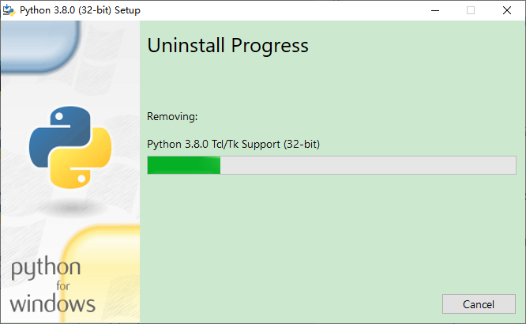

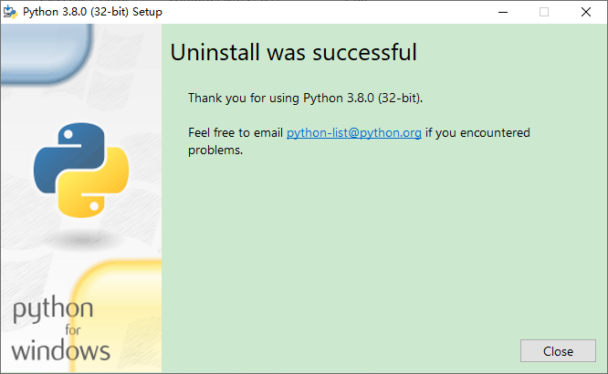

## 坚持使用Python3，Python2将在2020年寿终正寝

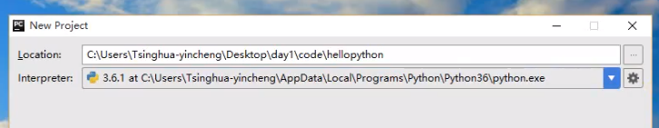

## Python3编码问题

**Python3只支持UTF-8**

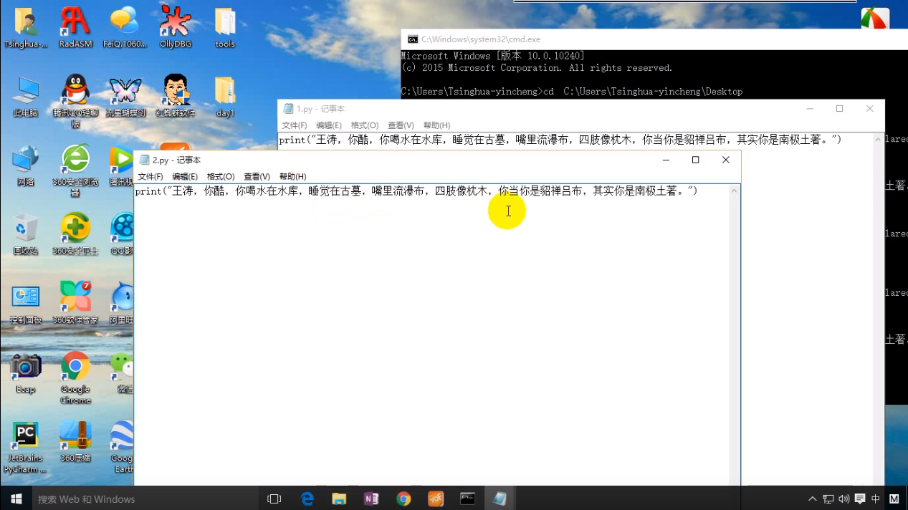

* 同样的文件内容，但是保存格式不同，会造成不同运行效果
