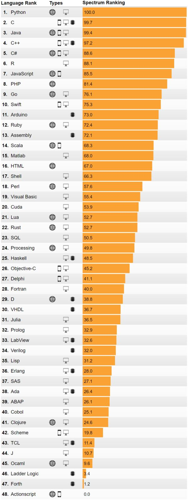
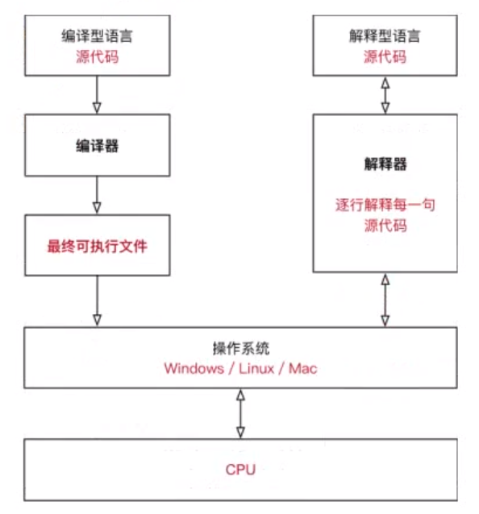

<!-- MDTOC maxdepth:6 firsth1:1 numbering:0 flatten:0 bullets:1 updateOnSave:1 -->

- [Python简介](#python简介)   
   - [Python历史](#python历史)   
   - [Python特性](#python特性)   
   - [Python缺点](#python缺点)   

<!-- /MDTOC -->
# Python简介

## Python历史

Python的创始人: Guido van Rossum；之所以选中Python（大蟒蛇的意思）作为该编程语言的名字，是因为他是一个叫Monty Python的喜剧团体的爱好者。

诞生于1989年。作者前身也是C++程序员，之前也参加设计了一种叫ABC的教学语言，就Guido本人看来，ABC 这种语言非常优美和强大，是专门为非专业程序员设计的。但是ABC语言并没有成功，究其原因，Guido 认为是其非开放造成的（相对封闭的开发语言、扩展性、推广性相对不太成功。）。Guido 决心在Python 中避免这一错误。同时，他还想实现在ABC 中闪现过但未曾实现的东西。

* 1991年，第一个Python编译器诞生。它是用C语言实现的，并能够调用C语言的库文件。从一出生，Python已经具有了：类，函数，异常处理，包含表和词典在内的核心数据类型，以及模块为基础的拓展系统。
* Granddaddy of Python web frameworks, Zope 1 was released in 1999
* Python 1.0 - January 1994 增加了 lambda, map, filter and reduce.
* Python 2.0 - October 16, 2000，加入了内存回收机制，构成了现在Python语言框架的基础
* Python 2.4 - November 30, 2004, 同年目前最流行的WEB框架Django 诞生
* Python 2.5 - September 19, 2006
* Python 2.6 - October 1, 2008
* Python 3.0 - December 3, 2008
* Python 3.1 - June 27, 2009
* Python 2.7 - July 3, 2010
* In November 2014, it was announced that Python 2.7 would be supported until 2020, and reaffirmed that there would be no 2.8 release as users were expected to move to Python 3.4+ as soon as possible
* Python 3.2 - February 20, 2011
* Python 3.3 - September 29, 2012
* Python 3.4 - March 16, 2014
* Python 3.5 - September 13, 2015

python是从2015年在国内火起来，之前为什么不火，因为国内情况一直稍落于外国强国，并且在刚开始的python其实很多缺点，因为是门高级语言，每次运行代码都需要解释器解释或者叫翻译一次才可以执行代码，速度比C等开发语言慢很多，直到后面出现两大转折点：

1. **因特尔的奔腾处理器出现，大大提高了机器的处理速度**，并且慢慢改进，现在的计算机配置基本是可以流畅运行，所以解决了python最大的诟病（不过相比其他比如C语言等的速度还是稍慢）。

2. **AI的兴起**，自从IBM公司的深蓝机器人把国际围棋高手打败后，机器人已经开始盛行，直到如今，阿法狗等的新式机器人出现，再到几个月前阿法狗机器人又一次把国际围棋高手--柯洁打败，阿法狗丢下一套围棋程序功成身退等等的事件充分说明——AI早已火得不能再火，并且国内几家互联网大公司，华为，锤子科技，联想等的已经投身于AI市场。

## Python特性

* 高效
* 易懂
* 易入门
* 代码简洁，优雅
* 实用性强
* 跨平台

* Python是解释型语言

## Python优点

* 优雅-使你能够专注于解决问题而不是去搞明白语言本身
* 功能强大-牛逼的兼容性-丰富的库
* 胶水语言-支持混合编译的方式使用其他语言的库
* 简单

## Python缺点

* 不适合大型项目开发
* 不适合写底层的程序
* 速度慢于C，Java等编译型语言

---

