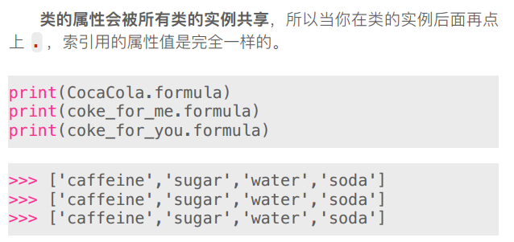

<!-- TOC depthFrom:1 depthTo:6 withLinks:1 updateOnSave:1 orderedList:0 -->

- [Python类的定义](#python类的定义)
	- [def关键字](#def关键字)
	- [类的属性](#类的属性)
		- [类属性的引用](#类属性的引用)
		- [类的特殊属性__dict__](#类的特殊属性dict)
	- [属性的引用机制](#属性的引用机制)
	- [类的方法](#类的方法)
	- [类的魔术方法__init__()](#类的魔术方法init)

<!-- /TOC -->
# Python类的定义

* 类就是设计图纸
* 类是有一系列共同特征的行为事物的抽象概念的总和

## def关键字

## 类的属性

### 类属性的引用

* 类的属性会被所有类的实例共享

### 类的特殊属性__dict__

* __dict__它是一个字典，用于存储类或者实例的属性，即使不去定义也会存在于每一个类中，默认隐藏

## 属性的引用机制

## 类的方法

## 类的魔术方法__init__()

* 类实例化的时候调用
* 即使没有定义也会引用

---
