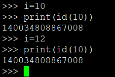
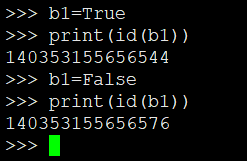
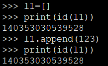
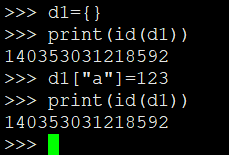

<!-- MDTOC maxdepth:6 firsth1:1 numbering:0 flatten:0 bullets:1 updateOnSave:1 -->

- [第七章函数基础可变不可变](#第七章函数基础可变不可变)   
   - [id函数](#id函数)   
   - [值类型=不可变类型（值改变地址发生变化，则认为此类型是不可变）](#值类型不可变类型（值改变地址发生变化，则认为此类型是不可变）)   
   - [引用类型=可变类型（内容发生变化，但是地址没有变化）](#引用类型可变类型（内容发生变化，但是地址没有变化）)   
      - [list类型时引用类型，是可变类型](#list类型时引用类型，是可变类型)   
      - [dict是引用类型，是可变类型](#dict是引用类型，是可变类型)   

<!-- /MDTOC -->
# 第七章函数基础可变不可变

## id函数

* id() 函数返回对象的唯一标识符，标识符是一个整数。
* CPython 中 id() 函数用于获取对象的内存地址。

## 值类型=不可变类型（值改变地址发生变化，则认为此类型是不可变）

int str float tunple bool

 

## 引用类型=可变类型（内容发生变化，但是地址没有变化）

### list类型时引用类型，是可变类型

### dict是引用类型，是可变类型

---
